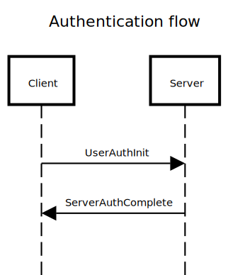

### What is OPAQUE?
The OPAQUE protocol is a password authenticated key exchange, designed to securely establish a shared secret key between two parties over an insecure network, such as the internet. The protocol allows for authetication to a server without your password ever leaving your device, while being robust to offline pre-computation attacks.

##### Further Reading
- **Let’s talk about PAKE** (blog post): https://blog.cryptographyengineering.com/2018/10/19/lets-talk-about-pake/
- **The OPAQUE Asymmetric PAKE Protocol. Make authentication secure again** (blog post): https://medium.com/@oleksii.vasylenko/the-opaque-asymmetric-pake-protocol-make-authentication-secure-again-366f821a319d
- **OPAQUE: The Best Passwords Never Leave your Device**: (blog post): https://blog.cloudflare.com/opaque-oblivious-passwords
- **OPAQUE: An Asymmetric PAKE Protocol
Secure Against Pre-Computation Attacks** (academic paper): https://eprint.iacr.org/2018/163.pdf

### Why gRPC?
Traditional registration and authentication flows take only 1 round trip between the client and the server. You send your password in plaintext and the server either stores or verifies it, usually using some salted hash function. OPAQUE on the other hand takes 2 round trips. This not only increases the overhead for completing the flow in terms of latency, serialization / deserialization cost etc, but also requires a session / some state stored on the server. In modern containerized applications it is recommended to have stateless apps to simplify the operational burden of scaling, deployment, and fault tolerance. By using gRPC as the communication protocol we can skirt some of the shortcoming of a 2 round trip flow. The gRPC protocol uses binary messages, and HTTP/2 which decrease the cost of additional round trips. GRPC streams also create a sort of sticky session with the server, so that in stateless deployments the client's messages don't end up being sent to the wrong backend instance mid flow. 

### Sequence Diagram

<!-- https://sequencediagram.org/ -->
<!-- title Registration flow
note over Client,Server:gRPC stream begins
note right of Server
Client->Server:UserRegisterInit
Server->Client:ServerRegisterInit
Client->Server:UserRegisterComplete
Server->Client: err, success
note over Client,Server:gRPC stream ends -->


_             |  _ 
:-------------------------:|:-------------------------:
 |  

<!-- ### Running the demo
1. Start client and server containers using docker compose: 
```
docker compose up --build
```
2. Get a shell in the client container
```
exec
```
3. Register / login with the cli application
```
``` -->
### Drawbacks
While this project was a fun exercise in implementing a new authentication protocol, there are a few critical drawbacks to using this in applications today. 

Both gRPC, and the golang implementation of OPAQUE used significantly reduces the types of clients supported. This implementation requires a golang client and server to be using the gopaque library. Also the gRPC stream used is not supported with clients running in the web browser due to the [limitations of gRPC-web](https://grpc.io/blog/state-of-grpc-web/).


A more viable solution (and production ready) to the problems addressed by OPAQUE here is [Passkeys](https://security.googleblog.com/2023/05/so-long-passwords-thanks-for-all-phish.html). 


### Resources
- OPAQUE golang implementation: https://github.com/cretz/gopaque
- OPAQUE demo in the browser: https://opaque-full.research.cloudflare.com/

